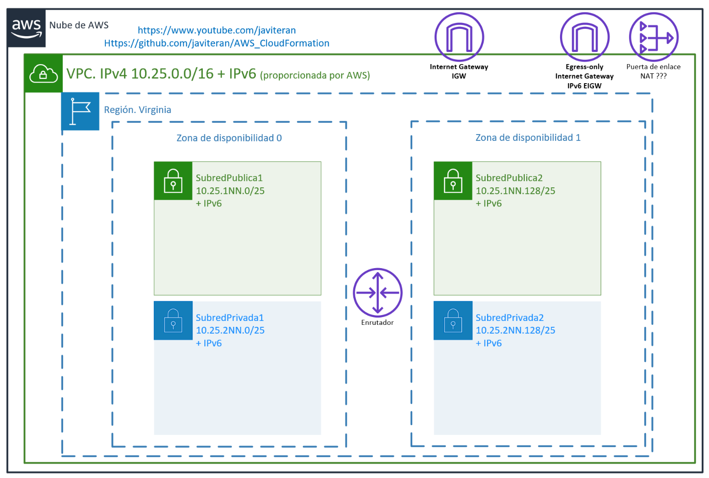

# Creación de una VPC IPv4/IPv6

## Objetivo

El objetivo de este laboratorio es crear una VPC con soporte para IPv4 e IPv6.
También se crearán dos subredes públicas y dos subredes privadas.

Para que todo funcione es necesario crear una puerta de enlace de internet IGW, una puerta de enlace de internet de sólo salida IPv6 EIGW, las tablas de enrutamiento y asociar las subredes a las tablas de enrutamiento.

Es un ejercicio muy interesante para:

* Ver el uso de parámetros de entrada en una plantilla de CloudFormation.
* Calcular bloques CIDR para las subredes y las tablas de enrutamiento tanto con IPv4 como con IPv6.
* Crear subredes públicas y privadas asociadas a distintas zonas de disponibilidad.
* Crear las tablas de enrutamiento para las subredes públicas y privadas.
* Asociar las subredes a las tablas de enrutamiento.
* Asociar las tablas de enrutamiento a las puertas de enlace de internet en las subredes públicas.
* Asociar las tablas de enrutamiento a las puertas de enlace de internet de sólo salida IPv6 en las subredes privadas.
* Crear OUTPUTS para obtener información de la VPC, las subredes y las tablas de enrutamiento.

## Recursos utilizados en la creación de una VPC

        AWS::EC2::VPC
        AWS::EC2::VPCCidrBlock
        AWS::EC2::Subnet
        AWS::EC2::InternetGateway
        AWS::EC2::EgressOnlyInternetGateway
        AWS::EC2::VPCGatewayAttachment
        AWS::EC2::RouteTable
        AWS::EC2::Route
        AWS::EC2::SubnetRouteTableAssociation

## 01 AWS CloudFormation Introducción. VPC IPv4/IPv6. IaC. AWS Academy. Youtube

## 02 AWS CloudFormation. Funciones CIDR.. Youtube

Explicación de funciones para tratamiento CIDR de direcciones IPv4 e IPv6 en VPC. **Funciones !Ref, !Select, !GetAtt, !Join y !Cidr** a utilizar en plantillas/stacks/pilas de AWS CloudFormation

* **!Ref VPC**  (Referencia a un recurso existente)
* **!Select [0,!GetAtt VPC.Ipv6CidrBlocks]** (Selecciona el elemento 0 (Select) de todos los bloques IPv6 de una VPC (GetAtt))
* **!GetAtt VPC.Ipv6CidrBlocks** (Devuelve un atributo. En este caso, los bloques CIDR IPv6 asociados con la VPC.)
* **!Cidr [ !GetAtt VPC.CidrBlock, 16, 12]]** (Divide en 16 subredes /20 (32-12) (Cidr) el bloque CIDR IPv4 principal de una VPC (GetAtt). )
* **!Join [ ", ", !Cidr [!GetAtt VPC.CidrBlock, 16, 12]]** (Une el valor de varios campos en una cadena separada por comas.)

## Creación del entorno de tareas

Con este fichero se creará el siguiente entorno de tareas:

## :blue_book:Diagramas de microsoft Visio

En la carpeta MicrosoftVisio se pueden encontrar los diagramas de Microsoft Visio de la plantilla de CloudFormation.

[AWSAcademy_IaC_AWSCloudFormation.vsdx](MicrosoftVisio/)