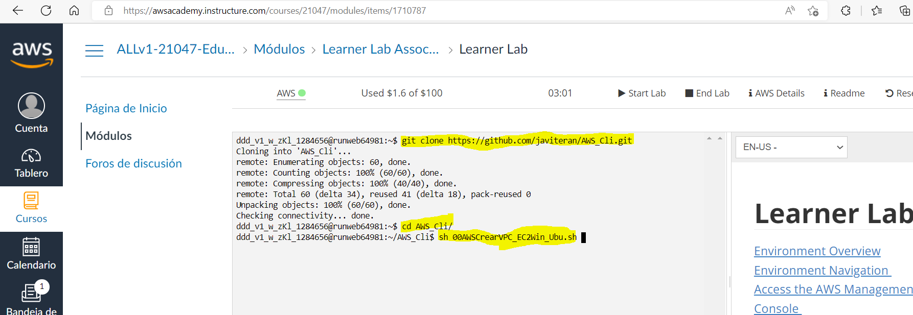
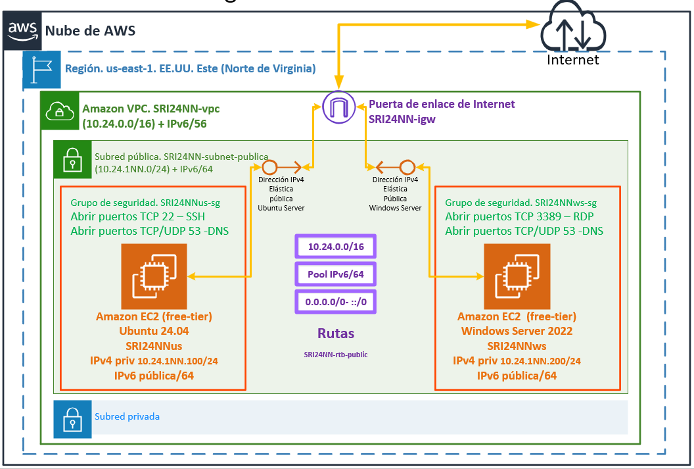

# :dizzy: Tareas en AWS Academy con AWS CloudFormation

Cuando utilizamos AWS Academy y su learner lab puede interesarnos personalizar el entorno de los alumnos.

Muestra una posible solución de automatización de la creación de entornos de tareas en AWS con AWS CloudFormation.

## :gear: Referencia de comandos AWS CloudFormation

https://docs.aws.amazon.com/AWSCloudFormation/latest/UserGuide/aws-resource-ec2-instance.html

## :collision: Configuración del entorno en el Learner Lab




## Creación del entorno con un parámetro de entrada que será el NN del alumno

```git
git clone https://github.com/javiteran/AWS_CloudFormation.git
cd AWS_CloudFormation

aws cloudformation create-stack --stack-name Lab03 --template-body file://00AWSLab01_dualstack.yaml --parameters ParameterKey=NN,ParameterValue=03
```

Con este fichero se creará el siguiente entorno de tareas:



Creará:

* Una VPC con Ipv4 e Ipv6
* Dos subredes públicas
* Dos subredes privadas
* Una puerta de enlace de internet
* La tabla de enrutamiento de las subredes publicas para permitir conectarse a internet
* Las tablas de enrutamiento de las subredes privadas
* Un grupo de seguridad para Ubuntu y otro para Windows.
* Se abrirán los puertos 80, 22 y 3389 para Windows y el 53 y 80  para Ubuntu.
* Se permitirá todo el tráfico entre las instancias de la VPC.
* Una instancia EC2 con Windows Server 2022 
  * Instancia t2.medium
  * PublicSubnet2
  * Dirección IPv4 privada 10.24.1NN.200/25
  * IIS

* Una instancia EC2 con Ubuntu Server 24.04 
  * Instancia t2.micro
  * PublicSubnet1
  * Disco principal de 20Gb
  * Dirección IPv4 privada 10.24.1NN.200/25
  * Apache2
* En Ubuntu y Windows se instalarán servicios y roles como DNS para probar la instalación en la creación.
* Direcciones IPs públicas estáticas para las instancias EC2

* Creación de variables export para utilizar con otra plantilla de CloudFormation. Ejemplo: añadir un RDS

## Verificación de la creación del stack

Para ver el estado del stack/pila

```aws-cli
aws cloudformation describe-stacks --stack-name Lab03

```

## Verificación de los eventos del stack
Si quieres ver todos los elementos creados con la pila y sus datos:

```aws-cli
aws cloudformation describe-stack-events --stack-name Lab03
```

# Eliminar la pila

```aws-cli
aws cloudformation delete-stack --stack-name Lab03

aws cloudformation describe-stacks --stack-name Lab03
```

# Validar la plantilla

```aws-cli
aws cloudformation validate-template --template-body file://00AWSLab01_dualstack.yaml
```
