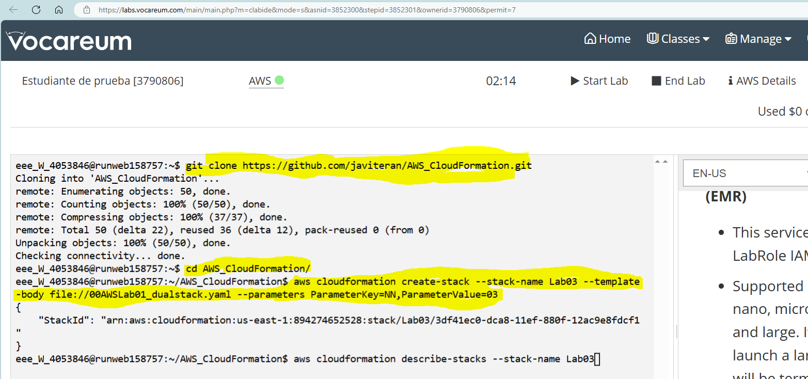

# :dizzy: Tareas en AWS Academy con AWS CloudFormation

Cuando utilizamos AWS Academy y su learner lab puede interesarnos personalizar el entorno de los alumnos.

Muestra una posible solución de automatización de la creación de entornos de tareas en AWS con AWS CloudFormation.

## :gear: Referencia de comandos AWS CloudFormation

https://docs.aws.amazon.com/AWSCloudFormation/latest/UserGuide/aws-resource-ec2-instance.html

## :collision: Configuración del entorno en el Learner Lab



## :white_check_mark: Creación del entorno con un parámetro de entrada que será el NN del alumno

```git
git clone https://github.com/javiteran/AWS_CloudFormation.git
cd AWS_CloudFormation

aws cloudformation create-stack --stack-name Lab03 --template-body file://00AWSLab01_dualstack.yaml --parameters ParameterKey=NN,ParameterValue=03
```

Con este fichero se creará el siguiente entorno de tareas:


Creará:

* Una VPC con Ipv4 e Ipv6
* Dos subredes públicas
* Dos subredes privadas
* Una puerta de enlace de internet
* La tabla de enrutamiento de las subredes publicas para permitir conectarse a internet
* Las tablas de enrutamiento de las subredes privadas
* Un grupo de seguridad para Ubuntu y otro para Windows.
* Se abrirán los puertos 80, 22 y 3389 para Windows y el 53 y 80  para Ubuntu.
* Se permitirá todo el tráfico entre las instancias de la VPC.
* Una instancia EC2 con Windows Server 2022
  * Instancia t2.medium
  * PublicSubnet2
  * Dirección IPv4 privada 10.24.1NN.200/25
  * IIS

* Una instancia EC2 con Ubuntu Server 24.04
  * Instancia t2.micro
  * PublicSubnet1
  * Disco principal de 20Gb
  * Dirección IPv4 privada 10.24.1NN.200/25
  * Apache2
* En Ubuntu y Windows se instalarán servicios y roles como DNS para probar la instalación en la creación.
* Direcciones IPs públicas estáticas para las instancias EC2

* Creación de variables export para utilizar con otra plantilla de CloudFormation. Ejemplo: añadir un RDS

## Verificación de la creación del stack

Para ver el estado del stack/pila

```aws-cli
aws cloudformation describe-stacks --stack-name Lab03

```

## Verificación de los eventos del stack

Si quieres ver todos los elementos creados con la pila y sus datos:

```aws-cli
aws cloudformation describe-stack-events --stack-name Lab03
```

## :x: Eliminar la pila

```aws-cli
aws cloudformation delete-stack --stack-name Lab03

aws cloudformation describe-stacks --stack-name Lab03
```

## :ballot_box_with_check: Validar la plantilla

```aws-cli
aws cloudformation validate-template --template-body file://00AWSLab01_dualstack.yaml
```

## :dizzy: AWS Academy CloudFormation. Otros ejemplos

En las carpetas de este repositorio se pueden encontrar otros ejemplos de plantillas de AWS CloudFormation para crear entornos de aprendizaje en AWS Academy.

### 00IntroduccionVPC. (Carpeta 00IntroduccionVPC)

Acceso al README.md de la carpeta: [README.md](00IntroduccionVPC/README.md)
  
* `00AWS_VPC_Introduccion.yaml`: [Introducción básica a la creación de una VPC con IPv4 e IPv6](00IntroduccionVPC/00AWS_VPC_Introduccion.yaml)
* `00AWS_VPC_EIGW.yaml`: [Crear VPC con IPv4 e IPv6 y una EIGW de IPv6 de sólo salida](00IntroduccionVPC/00AWS_VPC_EIGW.yaml)
* `FuncionCIDR_GetAtt_Join.yaml`: [Plantilla básica de uso de las funciones !CIDR, !GetAtt, !JOIN, !Ref, !Sub, Export](00IntroduccionVPC/FuncionCIDR_GetAtt_Join.yaml)

### Balanceador, RDS e instancias EC2 en subredes públicas + EC2 bastión. (Carpeta 09ALB_RDS_EC2Publicas)

Acceso al README.md de la carpeta: [README.md](09ALB_RDS_EC2Publicas/README.md)
  
* `09AWS_ALB_EC2Publicas_Export.yaml`: Creación de un balanceador de carga de aplicación ALB, con un grupo de destinos que tendrá 3 instancies EC2 ubuntu en las 3 subredes públicas. El código de la aplicación se carga de GitHub en el userdata de las instancias y se instala apache2, php, etc. Se añade un parámetro para preguntar si se quiere que los listener sean HTTP o también HTTPS. Si se selecciona HTTPS se creará un ACM y se añadirá el listener HTTPS pero será necesaria la intervención del usuario para añadir el DNS a su zona pública. (Los laboratorios de AWS Academy no permiten crear zonas públicas en Route53 y por eso será necesario validar los registros en zonas DNS externas).
Además se crean variables EXPORT a utilizar en la plantilla siguiente  [ALB, Target Groups, zona en Route53 privada, ACM, EC2, etc. ](09ALB_RDS_EC2Publicas/09AWS_ALB_EC2Publicas_Export.yaml)

* `09AWS_ALB_EC2Publicas_Import.yaml`: Crea un RDS, crea registros en la zona privada en Route53 y una instancia EC2 bastión cuyo user data crea el diseño de la base de datos  [RDS, Route53, EC2 ubuntu bastión y carga sql inicial](09AWS_RDS_EC2Publicas_Import.yaml)

### Balanceador, RDS e instancias EC2 en subredes privadas + EC2 bastión. (Carpeta 09ALB_RDS_EC2Privadas)

Acceso al README.md de la carpeta: [README.md](09ALB_RDS_EC2Privadas/README.md)
  
* `10AWS_ALB_EC2Privadas_Export.yaml`: ALB, Target Groups, Listeners, Route53 privada, ACM, 3 instancias EC2 ubuntu privadas, Puerta de enlace IPv6 EIGW, 1 EC2 ubuntu bastión en red pública [ALB, Target Groups, zona en Route53 privada, ACM, EC2, etc. ](10ALB_RDS_EC2Privadas/10AWS_ALB_EC2Privadas_Export.yaml)

* `10AWS_ALB_EC2Privadas_Import.yaml`: Crea un RDS, crea registros en la zona privada en Route53 y una instancia EC2 bastión cuyo user data crea el diseño de la base de datos  [RDS, Route53](10AWS_RDS_EC2Privadas_Import.yaml)

## :trident: AWS Academy y AWS Cli

Si prefieres utilizar AWS cli para el AWS Academy también puedes utilizar el repositorio de AWS Cli en:

https://github.com/javiteran/AWS_Cli

Utiliza bash y todos los comandos del aws-cli para automatizar la creación de entornos en AWS.


